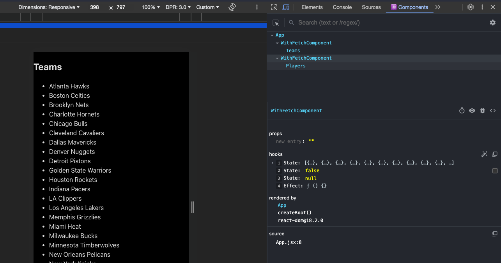

# react-advanced

* davidjj76
* https://github.com/davidjj76
* https://discord.com/channels/1112689497642115172/1112689499605049377

Partimos de los fundamentales de React:

* https://github.com/alexjust-data/FullStack11_0React_fundamentals


# React + Vite

This template provides a minimal setup to get React working in Vite with HMR and some ESLint rules.

Currently, two official plugins are available:

- [@vitejs/plugin-react](https://github.com/vitejs/vite-plugin-react/blob/main/packages/plugin-react/README.md) uses [Babel](https://babeljs.io/) for Fast Refresh
- [@vitejs/plugin-react-swc](https://github.com/vitejs/vite-plugin-react-swc) uses [SWC](https://swc.rs/) for Fast Refresh


# compartir lógica entre entre componentes

Vamos a ver unas mecánicas, unas técnicas para poder compartir lógica entre entre componentes.Hay veces que nosotros empezamos a codificar un componente que hace determinadas cosas y al rato estamos codificando un nuevo componente que hace cosas muy similares.Entonces ahí ya empezamos a notar que probablemente estemos repitiendo código, que los 2 componentes tienen código muy similar, cambian algunas cosas.Cambian cómo pintan la información a lo mejor, pero Pero la lógica de los 2 componentes es bastante repetida.Entonces, ¿cómo podemos sacar esa esa lógica? A determinadas entidades que pueden ser funciones, componentes, etcétera, para ponerla en común y que luego sea fácil de reutilizar y crear componentes que que que manejen esa lógica

```sh
npm create vite@latest

    Need to install the following packages:
    create-vite@5.1.0
    Ok to proceed? (y) y
    ✔ Project name: … react_advanced
    ✔ Select a framework: › React
    ✔ Select a variant: › JavaScript

    Scaffolding project in /Users/alex/Desktop/KEEPKODING/REACT_AVANZADO/GIT/FullStack14_react-advenced/react_advanced...

    Done. Now run:

        cd react_advanced
        npm install
        npm run dev


cd react_advanced 
npm install

    added 271 packages, and audited 272 packages in 16s

    97 packages are looking for funding
    run `npm fund` for details

    found 0 vulnerabilities

npm run dev

  VITE v5.0.11  ready in 736 ms

  ➜  Local:   http://localhost:5173/
  ➜  Network: use --host to expose
  ➜  press h + enter to show help
```

Hago limpieza de archivos creados por Vite, elimino `App.css` me quedo solo con el index.css

```js
//  me quedo con esto
function App() 
  return (
    <>
    </>
  )

export default App
```

Partimos de esta api free y abierta para hacer pruebas de conceptos: https://www.balldontlie.io/home.html#players

tiene dos ENDPOINTS
* GET https://www.balldontlie.io/api/v1/players
* GET https://www.balldontlie.io/api/v1/teams

Creo componente para pintar los equipos por pantalla `Teams.jsx`

```js
export default function Teams() {

  return (
    <div>
      <h2>Teams</h2>
    </div>
  );
}
```

```js
//  me quedo con esto
import Teams from './Teams';

function App(){
  return (
    <>
        <Teams />
    </>
  );
}

export default App
```

Quiero que este `<h2>Teams</>` genere un listado de equipos en el Browser
* `GET https://www.balldontlie.io/api/v1/teams` que los descargue y haga un page
* Ponerlos en estado local
* pintarlos

Cuando yo quiero o voy a tener datos en un componente que pueden cambiar a lo largo del tiempo, pues lo que hacía era definirme un Estado. Vamos a llamar Teams, con su función asociada para modificar ese estado. Esto lo hacíamos con `UseState`

```js
import { useState } from 'react';


export default function Teams({ color }) {
    const [teams, setTeams] = useState([]);
    const [isFetching, setIsFetching] = useState(false);
    const [error, setError] = useState(null);

  return (
    <div>
      <h2>Teams</h2>
      {isFetching && <div>Loading...</div>}
      {error && <div>Ooops, there was an error</div>}
      {(!isFetching && !error) && (
        <ul>
            {teams.map(team => (
                <li key={team.id}>{team.full_name}</li>
            ))}
        </ul>
      )}
    </div>
  );
}
```

¿como se hace para que nuestro componente se sincronice con nuesto api externo paea traerse los datos? con un efecto

```js
import { useEffect, useState } from 'react';


export default function Teams() {
    const [teams, setTeams] = useState([]);
    const [isFetching, setIsFetching] = useState(false);
    const [error, setError] = useState(null);

    useEffect(() => {
        setIsFetching(true);
        setError(null);

        fecth('https://www.balldontlie.io/api/v1/teams')
            .then(response => {
                if(!response.ok){ throw new Error('Oooops')}
                return response.json();
            })
            .then(result => setTeams(result.data))
            .catch(error => setError(error))
            .finally(() => {
                setIsFetching(false);
            });
    }, []);


  return (
    <div>
      <h2>Teams</h2>
      {isFetching && <div>Loading...</div>}
      {error && <div>Ooops, there was an error</div>}
      {(!isFetching && !error) && (
        <ul>
            {teams.map(team => (
                <li key={team.id}>{team.full_name}</li>
            ))}
        </ul>
      )}
    </div>
  );
};
```

Si te vas al Browser ya pinta. 

> [!NOTE]
> Ahora llega el compañero de producción y dice que quiere un componente similar para mostrar el listado de jugadores que tiene este endpoint : GET https://www.balldontlie.io/api/v1/players. Entonces de entrada nos plantearíamos hacer un componente para jugadores y copiar más o menos el codigo


Creo `Players.jsx`

```js
import { useEffect, useState } from 'react';


export default function Players() {
    const [players, setTeams] = useState([]);
    const [isFetching, setIsFetching] = useState(false);
    const [error, setError] = useState(null);

    useEffect(() => {
        setIsFetching(true);
        setError(null);

        fecth('https://www.balldontlie.io/api/v1/players')
            .then(response => {
                if(!response.ok){ throw new Error('Oooops')}
                return response.json();
            })
            .then(result => setPlayers(result.data))
            .catch(error => setError(error))
            .finally(() => {
                setIsFetching(false);
            });
    }, []);


  return (
    <div>
      <h2>Players</h2>
      {isFetching && <div>Loading...</div>}
      {error && <div>Ooops, there was an error</div>}
      {(!isFetching && !error) && (
        <ul>
            {players.map(player => (
                <li 
                  key={player.id}
                >{`${player.firts_name} ${player.last_name} `}</li>
            ))}
        </ul>
      )}
    </div>
  );
};
```

App

```js
//  me quedo con esto
import Teams from './Teams';
import Players from './Players';

function App(){
  return (
    <>
        <Teams />
        <Players />
    </>
  );
}

export default App
```

Fíjate que hacen cosas diferentes Pero su lógica de funcionamiento interna, si las ponemos una frente a otro, son muy parecidas. De hecho, he creado 1 he hecho un copyright y me crea el siguiente, y he tenido que que adaptar algunas cosas de acuerdo, bueno, pues sería interesante si podemos extraer lo que tienen en común: estos 2 componentes y poderlo utilizarlo y luego crear ser con ello capaces de crear un componenteTeams que utiliza esa abstracción para pintar los equipos y un componente players que utiliza esa abstracción para crear los equipos.Tenemos varias técnicas, como he dicho al principio, vamos a poder, por ejemplo, hacer Hyer del Components. Vamos a hacer.Vamos a poder hacer render Probs. Vamos a poder hacer custo hooks. 

* ¿cómo vamos a extraer aun componente toda la lógica del `fetch` (conectarse a datos, traer, manejar el estado)?
* ¿qué es lo que es particular a cada caso ? pues esto

```js
        <ul>
            {teams.map(team => (
                <li key={team.id}>{team.full_name}</li>
            ))}
        </ul>
```
es particular de casa caso el ¿qué hago con los datos y el estado de cada caso que me devuelve fetch? pues lo pinto, pero si me devuelve un objeto podría hacer algo más.

## Tecnica 1 : Render Props

Esta técnica es pasar una funcion como props(atributo) que sirve para renderizarlo.

Sacaremos lo comun y delegamos la parte de pintar lo delegamos a los componentes.  
Me creo componente `Fetch.js` nos interesa lo que va a ser comun, me copio y pego `Teams` por ejemplo


```js
import { useEffect, useState } from 'react';


// le paso los props/atributos para que sea más generico
export default function Fetch({initialData, url, renderData}) {
  const [data, setData] = useState(initialData);
  const [isFetching, setIsFetching] = useState(false);
  const [error, setError] = useState(null);

  useEffect(() => {
    setIsFetching(true);
    setError(null);

    fetch(url)
      .then(response => {
        if (!response.ok) {
          throw new Error('Oooops');
        }
        return response.json();
      })
      .then(result => setData(result.data))
      .catch(error => setError(error))
      .finally(() => {
        setIsFetching(false);
      });
  }, [url]);

  if (isFetching) {
    return <div>Loading...</div>;
  }
  if (error) {
    return <div>Ooops, there was an error!!!</div>;
  }

  return renderData(data);
}
```

Y ahora vamos a sustituir en `Teams` todo lo que ahora ya tengo aquí y me quedaría así:

```js
import Fetch from './Fetch';

export default function Teams() {
  return (
    <div>
      <h2>Teams</h2>
      <Fetch
        initialData={[]}
        url= "https://www.balldontlie.io/api/v1/teams"
        renderData={data => {
          return (
            <ul>
              {data.map(team => (
                <li key={team.id}
                >{team.full_name}</li>
              ))}
            </ul>
          );
        }}
      />
    </div>
  );
}
```

`Players`

```js
import Fetch from './Fetch';

export default function Players() {
  return (
    <div>
      <h2>Players</h2>
      <Fetch
        initialData={[]}
        url= "https://www.balldontlie.io/api/v1/players"
        renderData={data => {
          return (
            <ul>
              {data.map(player => (
                <li key={player.id}
                >{`${player.first_name} ${player.last_name}`}</li>
              ))}
            </ul>
          );
        }}
      />
    </div>
  );
}
```

## Técnica 2 :  Higher Order Component

**Las Higher Order Functions (HOF)**, o Funciones de Orden Superior en español, es una función que cumple al menos una de las siguientes condiciones:

* Acepta Funciones como Argumentos: Una HOF puede recibir una o más funciones como argumentos. Esto permite crear funciones más abstractas y reutilizables que pueden modificar o ampliar el comportamiento de otras funciones.

* Retorna una Función: Una HOF también puede devolver una función como resultado. Esto permite crear funciones que crean otras funciones, lo que puede ser útil para encapsular ciertos comportamientos o crear funciones con configuraciones personalizadas.

**Higher Order Component (HOC)**, o Componente de Orden Superior en español, es un patrón avanzado en React para reutilizar la lógica de componentes. Un HOC es una función que toma un componente y devuelve un nuevo componente. Los HOCs son comunes en bibliotecas de React y en aplicaciones React para extender o modificar el comportamiento de un componente existente de manera reutilizable.

* Es una Función: Un HOC es una función que acepta un componente como argumento.

* Devuelve un Nuevo Componente: El HOC procesa el componente entrante, posiblemente agregándole funcionalidades o modificando su comportamiento, y luego devuelve un nuevo componente.

* Composición sobre Herencia: En React, se prefiere la composición sobre la herencia para reutilizar el código entre componentes. Los HOC son una forma de realizar esta composición.

* No Modifica el Componente Original: Un HOC crea un nuevo componente sin modificar el componente original. Esto mantiene los componentes separados y promueve la reutilización del código.


Ahora vamos a crear un Higher Order Component para que se ocupe de la loginca de fecth y luego vamos a refectorizar todos nuestros componentes para que lo utilice este Higher Order Component.

Creamos `withFetch.jsx` es cnovención llamarlo con `with...` delante

```js
import { useEffect, useState } from 'react';

// recibe un componente
export default function withFetch(WrappedComponent, { initialData, url }) {
  // creo y retorna un componente
  // cuendo llames a withFetch tendrás esta composición a la vuelta
  function WithFetchComponent(props) {


    return WithFetchComponent;
  };
}
```

Puedes ver como en Teams le digo que retorne con un componente de entrada

```js
import Fetch from './Fetch';
import withFetch from './withFetch';

function Teams() {
  return (
    <div>
      <h2>Teams</h2>
      <Fetch
        initialData={[]}
        url= "https://www.balldontlie.io/api/v1/teams"
        renderData={data => {
          return (
            <ul>
              {data.map(team => (
                <li key={team.id}
                >{team.full_name}</li>
              ))}
            </ul>
          );
        }}
      />
    </div>
  );
}

// llamo a withFetch pasándole Teams
const TeamswithFetch = withFetch(Teams);

export default TeamswithFetch;
```


Entonces, vamos a merter toda la lógica del `<Fetch` inyectándole una propiedad **data** en `function Teams(data) {` para utilizarla y renderizar lo que quieras. Vamos hacer eso y envovler lo componente para inyectar al adata que se resuelva en ese fetch.

```js
import { useEffect, useState } from 'react';

export default function withFetch(WrappedComponent, { initialData, url }) {
    function WithFetchComponent(props) {
      const [data, setData] = useState(initialData);
      const [isFetching, setIsFetching] = useState(false);
      const [error, setError] = useState(null);

      useEffect(() => {
        setIsFetching(true);
        setError(null);

        fetch(url)
          .then(response => {
            if (!response.ok) {
              throw new Error('Oooops');
            }
            return response.json();
          })
          .then(result => setData(result.data))
          .catch(error => setError(error))
          .finally(() => {
            setIsFetching(false);
          });
      }, []);

      if (isFetching) {
        return <div>Loading...</div>;
      }
      if (error) {
        return <div>Ooops, there was an error!!!</div>;
      }

      return <WrappedComponent data={data} {...props} />;
    }
    return WithFetchComponent;
};
```

Todo lo que envuelvas con este componente `<WrappedComponent data={data} {...props} />;` estará haciendo lo mismo que el propio coponente pero recbiento una prop¡edad extra llamada data.


```js
import withFetch from './withFetch';

function Teams({ data: teams }) {
  return (
    <div>
      <h2>Teams</h2>
        <ul>
          {teams.map(team => (
            <li key={team.id}
            >{team.full_name}</li>
          ))}
        </ul>
    </div>
  );
}

// llamo a withFetch pasándole el componete Teams y dos opciones
const TeamswithFetch = withFetch(Teams, {
  initialData: [], 
  url: "https://www.balldontlie.io/api/v1/teams"
});

export default TeamswithFetch;
```

Fíjate que con estas lineas vemos que se crea el componente 1 vez sólamente


```js
const TeamswithFetch = withFetch(Teams, {
  initialData: [], 
  url: "https://www.balldontlie.io/api/v1/teams"
});
```

> [!NOTE]
> Esta es la principal diferencia con **Tecnica 1 : Render Props** que es totalmente dinámico porque funciona por componentes y props. y **Técnica 2 :  Higher Order Component** es estático.


`Players`

```js
import withFetch from './withFetch';


function Players({ data: players }) {
  return (
    <div>
      <h2>Players</h2>
      <ul>
        {players.map(player => (
          <li key={player.id}>{`${player.first_name} ${player.last_name}`}</li>
        ))}
      </ul>
    </div>
  );
}

// llamo a withFetch pasándole el componete Teams y dos opciones
const PlayerswithFetch = withFetch(Players, {
  initialData: [], 
  url: "https://www.balldontlie.io/api/v1/players"
});


export default PlayerswithFetch;
```

Fíjate que toda la lógica de los componentes ahora están en `WithFetchComponent` que hemos declarado en nuestro **Higher Order Component**



UN probelma que tienen los Higher Order Component es que si le quiero pasar una propiedad desde fuera a por ejemplo `<Teams color="red" />` de App

Le pasaríamos a Temas el color como atributo para pintar el stylo

```js
function Teams({ data: teams, color }) {
  return (
    <div style={ {color} }>
      <h2>Teams</h2>
```

Tendrías que pasarle al componente esta propiedad colors

```js
export default function withFetch(WrappedComponent, { initialData, url }) {

    function WithFetchComponent({ color }) {
      const [data, setData] = useState(initialData);
      const [isFetching, setIsFetching] = useState(false);
      const [error, setError] = useState(null);

  ...

      return <WrappedComponent data={data} color={color} />;
    }
    
    return WithFetchComponent;
};
```

Así llega a su destino, pero `function WithFetchComponent()` no tiene nada que decir sobre las propiedades que reciba entonces **que las deje pasar** así:

```js
export default function withFetch(WrappedComponent, { initialData, url }) {

    function WithFetchComponent( props ) {
      const [data, setData] = useState(initialData);
      const [isFetching, setIsFetching] = useState(false);
      const [error, setError] = useState(null);

  ...
      // el orden es importante porque el componente se sobreescribe
      return <WrappedComponent data={data} {...props} />;
    }
    
    return WithFetchComponent;
};
```

> [!NOTE]
> Dentro de la funcion de un componete nunce hemos de crear componentes. Sólo puedo crear elementos pero no componentes.

Imaginate que tu tienes otro **Higher Order Component** que pinta la propiedad color, para que eso se pueda inyectar y hacer de una forma limpia y se pueda concatenar utilidades de programacion funcional como vite , es conveniente que el prámetro **Higher Order Component** se mantenga aislado (estamos hablando del `Players`)

```js
const PlayerswithFetch = withFetch(Players, {
  initialData: [], 
  url: "https://www.balldontlie.io/api/v1/players"
});
```
Para ello he de conseguir que mi **Higher Order Component** sólo le pase este parámetro  `Players` ¿como le paso los otros? pues sobreescribimos de la siguente manera en `withFetch` envolviendo en una nueva funcion y exportando una funcion que va a crear internamoente una funcion que va a ser la que va a recibir el componente

```js
import { useEffect, useState } from 'react';

// le paso primera la configuracion
export default function withFetch({ initialData, url }) {
  // envolvemos con una función externa este componente que queremos
  return function (WrappedComponent) {
    function WithFetchComponent(props) {
      const [data, setData] = useState(initialData);
      const [isFetching, setIsFetching] = useState(false);
      const [error, setError] = useState(null);

      useEffect(() => {
        setIsFetching(true);
        setError(null);

        fetch(url)
          .then(response => {
            if (!response.ok) {
              throw new Error('Oooops');
            }
            return response.json();
          })
          .then(result => setData(result.data))
          .catch(error => setError(error))
          .finally(() => {
            setIsFetching(false);
          });
      }, []);

      if (isFetching) {
        return <div>Loading...</div>;
      }
      if (error) {
        return <div>Ooops, there was an error!!!</div>;
      }

      return <WrappedComponent data={data} {...props} />;
    }
    return WithFetchComponent;
  };
}

```
Es decir, cuando hayas de escribir un **Higher Order Component** que le tangas que pasar determinado parametro a parte hazlo así.

Ahora has de modificar `Teams` y `Players`

```js
...

const withFetchConfig = withFetch({
  initialData: [],
  url: 'https://www.balldontlie.io/api/v1/players',
});

const PlayersWithFetch = withFetchConfig(Players)

export default PlayersWithFetch;
```


## Técnica 3 : Creando nuestros propios hooks

> [!NOTE] 
> Harás Customs Hooks a diario.  
> Para cualquier cosa que veas que sea un trozo de lógica de un componente que se está repitiendo en dos componentes, pues ya puedes pensar "esto lo saco en un customHook y lo reutilizo".  
> Pero si es verdad que las dos técnicas anteriores las verás seguramente igual (aunque se usen menos).  

En el contexto de JavaScript, especialmente en relación con React, un "hook" es una característica especial que permite a los componentes funcionales de React tener acceso a características que antes solo estaban disponibles en los componentes de clase. Los hooks son una parte esencial de React moderno y han permitido a los desarrolladores escribir componentes más expresivos y eficientes, facilitando la gestión del estado y el ciclo de vida de los componentes.

Beneficios de los Hooks

* Simplificación de Componentes: Permiten escribir componentes más limpios y legibles, evitando la necesidad de clases para cosas como el estado y los efectos secundarios.
* Reutilización de Lógica de Estado: Facilitan la reutilización de lógica de estado entre componentes sin necesidad de componentes de orden superior (HOCs) o render props.
* Organización del Código: Mejoran la organización del código, agrupando lógica relacionada de manera más natural que los métodos de ciclo de vida en componentes de clase.


Tipos Principales de Hooks en React

* useState : Permite a los componentes funcionales tener su propio estado local. Antes de los hooks, solo los componentes de clase podían tener estado local.

* useEffect : Permite a los componentes funcionales ejecutar efectos secundarios, como solicitudes de datos, suscripciones o manipulaciones del DOM manualmente, similar a los métodos de ciclo de vida en componentes de clase como componentDidMount, componentDidUpdate, y componentWillUnmount.

* useContext : Permite a los componentes funcionales acceder al contexto de React sin tener que utilizar un Consumer.

* useReducer : Ofrece una alternativa a useState para manejar estados complejos mediante un reductor (reducer).

* useRef : Permite a los componentes funcionales acceder y interactuar con nodos del DOM y guardar referencias a valores mutables que no causan re-renderizados cuando cambian.

* useMemo y useCallback : useMemo se usa para memorizar valores costosos de calcular.
useCallback memoriza funciones para evitar re-creaciones innecesarias en re-renderizados.

> [!WARNING]
> Continuamos con el codigo


Me creo `useFetch.js`

```js
export default function useFetch({ initialData, url }) {

}
```
dentro vamos a meter toda la lógica de `Fetch.jsx` simplificando cosas. Fíjate que un `customHook` lo que no puede hacer es renderizar cosas, pero si podemos devolver cosas como un objeto que tenga la data `isFetching, error`

```js
import { useEffect, useState } from 'react';

export default function useFetch({ initialData, url }) {
  const [data, setData] = useState(initialData);
  const [isFetching, setIsFetching] = useState(false);
  const [error, setError] = useState(null);

  useEffect(() => {
    setIsFetching(true);
    setError(null);

    fetch(url)
      .then(response => {
        if (!response.ok) {
          throw new Error('Oooops');
        }
        return response.json();
      })
      .then(result => setData(result.data))
      .catch(error => setError(error))
      .finally(() => {
        setIsFetching(false);
      });
  }, [url]);

  return { data, isFetching, error };
}

```

Has creado la funcion que tiene que toda la logica de mantener el estado de `data, isFetching, error` y ejecutar el `useEffect` para inicializar el `fetch` y devuelve esto `return { data, isFetching, error };` para trabajar luego.

¿como se usa esto? Me voy al componente `Teams` por ejemplo

```js
import useFetch from '../../../react-advanced/src/useFetch';


export default function Teams({ color }) {
  const { data: teams, isFetching, error } = useFetch({
    initialData: [],
    url: 'https://www.balldontlie.io/api/v1/teams'
  })
  return (
    <div style={ {color} }>
      <h2>Teams</h2>
        <ul>
          {teams.map(team => (
            <li key={team.id}
            >{team.full_name}</li>
          ))}
        </ul>
    </div>
  );
}
```

De esta forma estás utilizando el **hook** `Fetch` useFetch

> [!NOTE]
> MOCKEANDO API´s
> minuto 3:23 video 1  
> interesante api para trabajar  
> www.mswjs.io API mocking for JS  
> "Mockear" una API se refiere al proceso de simular una API real para propósitos de prueba o desarrollo.   

Vamos a seguir lo pasos para usar esta api www.mswjs.io

```sh
npm install msw --save-dev

# creará un archivo en la carpeta `public/`
npx msw init public
``` 

me creo un modulo `src/mocks/browser`

```js
// src/mocks/browser.js
import { setupWorker } from 'msw/browser';
import { handlers } from './handlers';

export const worker = setupWorker(...handlers);
```


```js
import { HttpResponse, http } from 'msw';

export const handlers = [
  http.get('https://www.balldontlie.io/api/v1/teams', () => {
    console.log('Intercepted');
    return HttpResponse.json({
      data: [
        { id: 1, full_name: 'Boston Celtics - mock' },
        { id: 2, full_name: 'Los Angeles Lakers - mock' },
      ],
    });
  }),
];

```

En main envolvemos la aplicación

```js
import React from 'react'
import ReactDOM from 'react-dom/client'
import App from './App.jsx'
import './index.css'

ReactDOM.createRoot(document.getElementById('root')).render(
  <React.StrictMode>
    <App />
  </React.StrictMode>,
)
```

Esta función activa el mocking de API con MSW (Mock Service Worker) solo en el entorno de desarrollo.`import.meta.env.DEV` es verdadero cuando el proceso de construcción se ejecuta en modo de desarrollo. Esto asegura que MSW solo se inicie en desarrollo, evitando interferencias en producción.

```js
import React from 'react';
import ReactDOM from 'react-dom/client';
import App from './App.jsx';
import './index.css';


// Esta función activa el mocking de API con MSW (Mock Service Worker) solo en el entorno de desarrollo.
// `import.meta.env.DEV` es verdadero cuando el proceso de construcción se ejecuta en modo de desarrollo.
// Esto asegura que MSW solo se inicie en desarrollo, evitando interferencias en producción.
async function enableMocking() {
  if (import.meta.env.DEV) {
    const { worker } = await import('./mocks/browser');
    return worker.start();
  }
}

enableMocking().then(() => {
  ReactDOM.createRoot(document.getElementById('root')).render(
    <React.StrictMode>
      <App />
    </React.StrictMode>,
  );
});
```


---

**Ejemplos :**

**Tecnica 1 : Vamos hacer un componente vista usando RenderProps**

En `Teams` tenemos una **lista** y podemos extraerlo a un Render Prop

```js
        <ul>
          {teams.map(team => (
            <li key={team.id}
            >{team.full_name}</li>
          ))}
        </ul>
```
Puedes ver cómo React trabaja para crear vistas de una lista:  

https://reactnative.dev/docs/using-a-listview   

Al final es hacer un poco lo mismo. Creamos componente `List.jsx`

```js
export default function List({
  data, // la data la pasa quien está llamando el componente
  renderItem, // pásale una función que renderice el contenido del item
  getKey, // pásale una función que de el id a la key
  listComponent = 'ul',
}) {
  const Component = listComponent;

  return (
    <Component>
      {data.map(item => (
        <li key={getKey(item)}>{renderItem(item)}</li>
      ))}
    </Component>
  );
}
```

Ahora podemos ir al componente `Teams` y darle el componente

```js
import useFetch from '../../../react-advanced/src/useFetch';
import List from './List';

export default function Teams({ color }) {
  const { data: teams, isFetching, error } = useFetch({
    initialData: [],
    url: 'https://www.balldontlie.io/api/v1/teams'
  })
  return (
    <div style={ {color} }>
      <h2>Teams</h2>
      <List 
        data={teams} 
        renderItem={team => team.full_name}
        getKey={item => item.id} 
      />
    </div>
  );
}
``` 

List no conoce el dato, sólo se encarga de la estructura.

Ahora si queremos podemos refactorizar igual el componente `Players`

```js
import withFetch from './withFetch';
import List from './List';


function Players({ data: players }) {
  return (
    <div>
      <h2>Players</h2>
      <List 
        data={players} 
        renderItem={player => player.first_name + ' ' + player.last_name}
        getKey={player => player.id} 
      />
    </div>
  );
}

const withFetchConfig = withFetch({
  initialData: [],
  url: 'https://www.balldontlie.io/api/v1/players',
});

const PlayersWithFetch = withFetchConfig(Players)

export default PlayersWithFetch;
```


